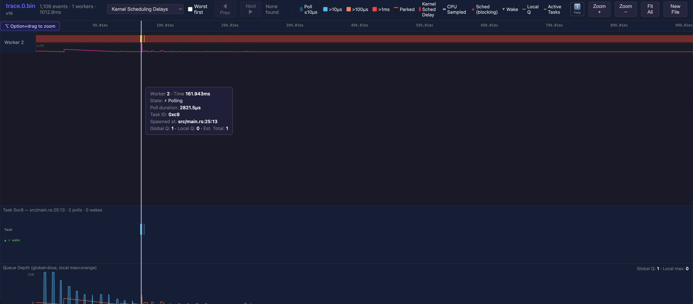

### Build

```bash
cargo build
```

### Run

```bash
./run.sh
```

### Visualize Traces

Open https://dial9-tokio-telemetry.russell-r-cohen.workers.dev/ and drag in the `.bin` file from `target/traces/`.



### Result

```
Wave 0 result: 24401
Wave 1 result: 24985
Wave 2 result: 23105
Wave 3 result: 26073
Wave 4 result: 24809
Wave 5 result: 25313
Wave 6 result: 24281
Wave 7 result: 26401
Wave 8 result: 25985
Wave 9 result: 24105
Collected 200 values, total: 101436
Counter: 101436
Traces written to target/traces/
```
