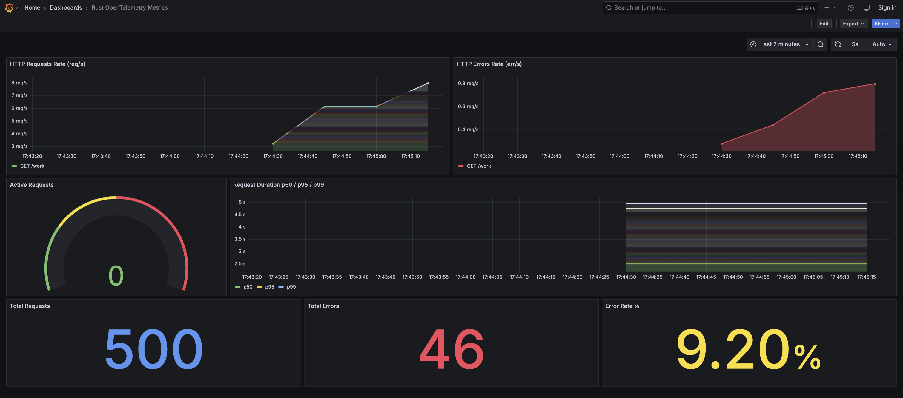

# open-telemetry-rust-fun

Rust 1.93+ (edition 2024) application using Actix-Web and Tokio with custom OpenTelemetry metrics exposed via Prometheus and visualized in Grafana.

### Custom OpenTelemetry Metrics

* `http_requests_total` - Counter for total HTTP requests
* `http_errors_total` - Counter for total HTTP errors
* `http_active_requests` - UpDownCounter for in-flight requests
* `http_request_duration_seconds` - Histogram for request latency

### Grafana Dashboard



### How to Run

```bash
./run.sh
```

### Generate Data

```bash
./generate-open-tel-data.sh
```

### Start/Stop Infrastructure

```bash
./start.sh
./stop.sh
```

### Endpoints

* `http://localhost:8080/` - Service info
* `http://localhost:8080/health` - Health check
* `http://localhost:8080/work` - Simulated work (generates metrics)
* `http://localhost:8080/metrics` - Prometheus metrics
* `http://localhost:3000/d/rust-otel-dashboard` - Grafana Dashboard
* `http://localhost:9090` - Prometheus UI

### Stack

* Rust + Actix-Web + Tokio
* OpenTelemetry SDK + Prometheus Exporter
* Prometheus (scraping)
* Grafana (visualization)
* Podman Compose
