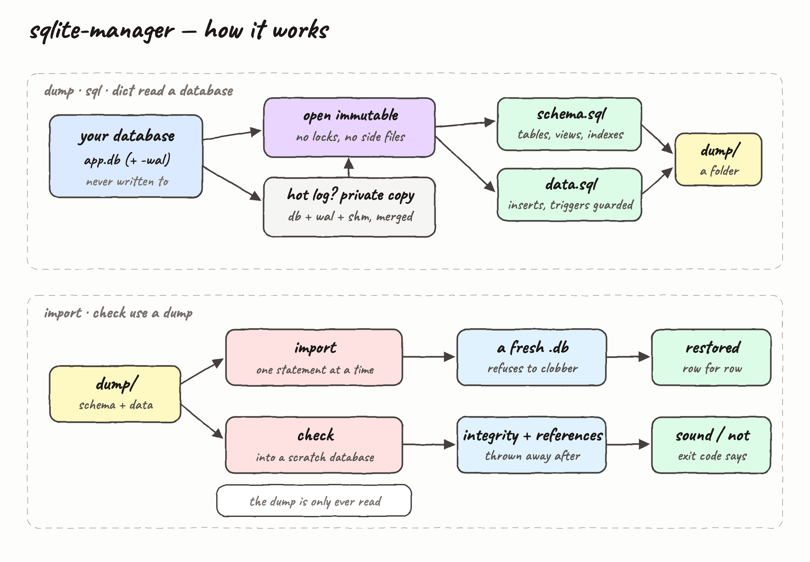
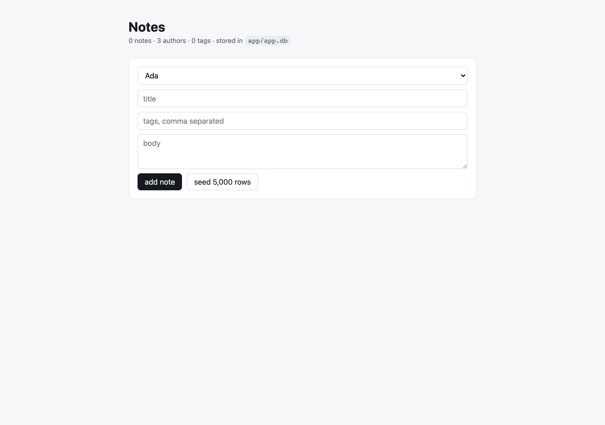
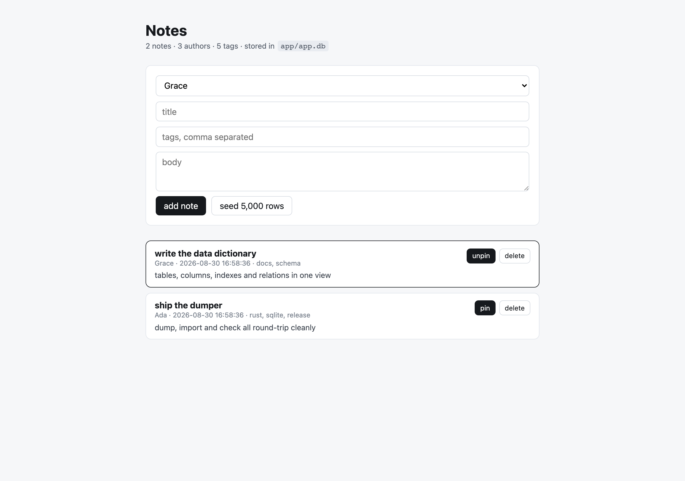
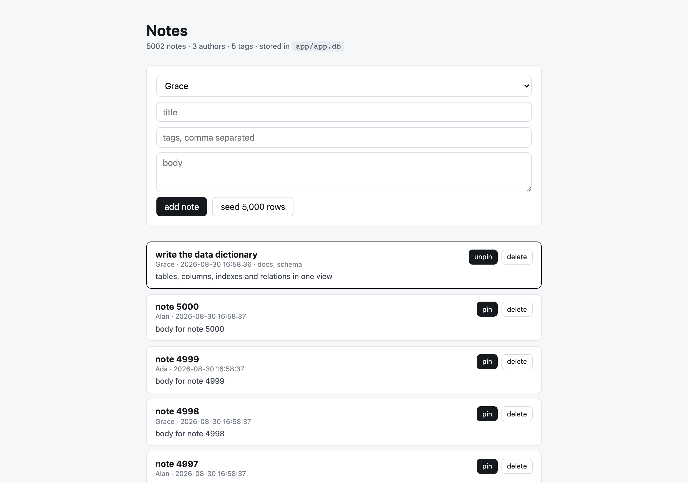

A Rust CLI that backs up, restores, verifies, queries and documents SQLite databases. It reads a `.db` file and writes a `schema.sql` plus a `data.sql` that together rebuild the database exactly, restores that dump into a fresh database, tells you whether a dump is still sound, opens a SQL shell over a database, and prints a data dictionary of everything in it.

The source database is never written to, locked, or moved.

## How it Works

`dump` opens the database read only and immutable, so SQLite takes no locks and creates no `-wal` or `-shm` files next to it. When a hot write-ahead log is found, the database and its log are copied to a private scratch directory first, the log is merged there, and the dump is taken from that copy — so a live application keeps running and its files stay byte for byte identical.

Schema objects come out of `sqlite_master` in dependency order. Row data is streamed a row at a time and written as `INSERT` statements with explicit column lists, so generated columns are skipped and FTS shadow tables never leak in. Triggers are dropped at the top of `data.sql` and recreated at the bottom, so replaying the data cannot fire them a second time and corrupt the restore.

`import` and `check` replay a dump one statement at a time, using SQLite's own parser to decide where each statement ends. `check` replays into a throwaway database, then runs `integrity_check` and `foreign_key_check` and exits non-zero if anything is wrong.

## Architecture



## Features

- **`dump`** — writes `schema.sql` and `data.sql` from a database, or from the only database it finds in a directory. Split files let you review the schema without wading through millions of inserts.
- **`import`** — rebuilds a database from a dump directory. Refuses to overwrite an existing file unless `--force` is passed, so a restore can never silently destroy a database.
- **`check`** — replays a dump into a scratch database and runs integrity and foreign key checks. A backup you have never restored is not a backup.
- **`sql`** — an interactive shell with SQL syntax highlighting, line numbers, tab completion over keywords, tables and columns, multi-line statements and box-drawn result tables. Read only unless `--write` is passed.
- **`dict`** — the data dictionary: every table with its columns, types, constraints, indexes, views, triggers and the full relation graph. Answers "what is in this database" in one screen.
- **Never touches the source** — read only and immutable by default, private copy when a log is hot, and a guard that refuses to write output over the database being read.
- **Fine grained progress** — a bar per stage and a nested bar per table with live row counts, so a long dump tells you exactly which table it is on.
- **Faithful values** — blobs as hex, invalid UTF-8 as a cast blob, full float precision, doubled quotes in text and identifiers, `sqlite_sequence` restored so `AUTOINCREMENT` continues where it left off.

## Stack

- **Rust 2024 edition, rustc 1.98.0** — one static binary, no runtime to install alongside it.
- **rusqlite (bundled SQLite)** — SQLite is compiled into the binary, so there is no system SQLite version to match.
- **indicatif** — the multi-bar progress rendering; it hides itself when output is piped.
- **rustyline** — line editing for the `sql` shell, driving the highlighter and completer.
- **Bun + Vite + React** (in `app/`) — a small notes app that writes to SQLite, used to exercise the CLI against a live, actively written database.

Argument parsing is hand written rather than pulled from a crate; the surface is small enough that a dependency would cost more than it saves.

## Commands

```
sqlite-manager <COMMAND> [ARGS]

dump   [PATH] [-o DIR]     read a database and write schema.sql and data.sql
import <DIR> [-o FILE]     rebuild a database from a dump directory (--force to overwrite)
check  <DIR>               rebuild a dump in a scratch database and report if it is sound
sql    [PATH] [--write]    SQL shell with highlighting, line numbers, completion, tables
dict   [PATH]              print the data dictionary
help                       print the help
version                    print the version
```

`PATH` may be a database file or a directory to search; it defaults to the current directory. Running with no arguments prints the help.

### Notes app API

The app in `app/` is a plain REST service on `http://localhost:7777`.

| Method | Path | Body | Returns |
| --- | --- | --- | --- |
| `GET` | `/api/authors` | | authors |
| `GET` | `/api/notes` | | notes with author and tags |
| `GET` | `/api/stats` | | counts of authors, notes, tags |
| `POST` | `/api/notes` | `{authorId, title, body, tags}` | the new note list, `201` |
| `POST` | `/api/seed` | `{rows}` | `{inserted}` |
| `PATCH` | `/api/notes/:id` | | the note list, pin toggled |
| `DELETE` | `/api/notes/:id` | | the note list |

## Key data structures and design decisions

- **`Source`** wraps the read-only connection and owns an optional `Workspace`. Field order matters: the connection is declared before the workspace so it is dropped first, and the scratch directory is only removed once SQLite has let go of it.
- **`Workspace`** is a temp directory that deletes itself on `Drop`. Both the hot-log copy and `check`'s scratch database use it, so no cleanup path can be forgotten.
- **Statement splitting uses `sqlite3_complete`**, not a `;` scan. A `CREATE TRIGGER ... BEGIN ... END;` body and a multi-line string literal both contain semicolons that do not end the statement.
- **Triggers are guarded in `data.sql`**, not reordered in `schema.sql`. `schema.sql` stays a complete, readable description of the schema, and the data file stays safe to replay on its own.
- **`PRAGMA table_list` classifies tables** so FTS shadow tables are excluded from both the schema and the data, while the virtual table itself is dumped and rebuilt normally.
- **Column lists are explicit** in every `INSERT`. Generated columns cannot be inserted into, and an explicit list keeps a dump valid if the schema later gains a column.
- **Errors carry a file and line**, so a bad dump reports `data.sql:4: near "INSRT": syntax error` rather than a bare failure.

## How to run

```bash
./build.sh          # fmt check, clippy with warnings denied, release build
./test.sh           # 14 unit tests and 6 end-to-end tests
./install.sh        # builds and installs to /usr/local/bin (BIN_DIR= to override)
./uninstall.sh      # removes it again
./run.sh dump ./my.db -o backup
```

The end-to-end tests drive the real binary: they assert the source file is byte identical after a dump, that a hot write-ahead log is included without the live files changing, that a trigger does not fire twice during a restore, and that `check` rejects syntax errors, truncated files and broken references.

### What it looks like

```
$ sqlite-manager dump app/app.db -o backup
source  /path/to/app/app.db
target  backup
note    a write-ahead log was merged from a private copy, the source was left alone

schema.sql     1018 B  7 objects
data.sql     720.8 KB  5 tables, 5,018 rows

$ sqlite-manager check backup
checking  backup

schema.sql     1018 B  7 objects
data.sql     720.8 KB  5,018 rows

the dump rebuilds cleanly and is sound

$ sqlite-manager import backup -o restored.db
source  backup
target  restored.db

restored  528.0 KB  7 objects, 5,018 rows
```

While a dump runs, a bar tracks the stage and a nested bar tracks the table:

```
⠉ data     [━━━━━━━━━╌╌╌╌╌╌╌╌╌╌╌╌╌╌╌╌╌╌╌╌╌╌╌╌╌]     1/4     posts
   posts                    [━━━━━━━━━━━━━━━━━━━━━━━━╌╌╌╌╌]   101,957/120,000   rows
```

`dict` prints the schema and the relation graph:

```
$ sqlite-manager dict app/app.db
database  /path/to/app/app.db
4 tables, 1 view, 2 indexes, 0 triggers

TABLE notes  (5,002 rows)
  id          INTEGER  primary key
  author_id   INTEGER  not null
  title       TEXT     not null
  body        TEXT     not null, default ''
  pinned      INTEGER  not null, default 0
  created_at  TEXT     not null, default datetime('now')
  index idx_notes_created (created_at)
  index idx_notes_author (author_id)
  references author_id -> authors.id

RELATIONS
  note_tags.tag_id -> tags.id  on delete cascade
  note_tags.note_id -> notes.id  on delete cascade
  notes.author_id -> authors.id  on delete cascade
```

`sql` opens the shell. Keywords colour as you type, the prompt counts lines, Tab completes, and results come back as tables:

```
sqlite-manager sql app/app.db  (read only)
.help lists the shell commands, .quit leaves

   1 sql> SELECT a.name, count(*) AS notes
   2 ...> FROM notes n JOIN authors a ON a.id = n.author_id
   3 ...> GROUP BY a.name ORDER BY notes DESC;
┌───────┬───────┐
│ name  │ notes │
├───────┼───────┤
│ Ada   │ 1668  │
│ Grace │ 1667  │
│ Alan  │ 1667  │
└───────┴───────┘
3 rows
```

## The notes app

`app/` holds a small React app served by Vite, with a Bun API that writes to `app/app.db` in WAL mode. It exists so the CLI can be exercised against a database that a real process is holding open and writing to.

```bash
cd app
./start.sh     # installs if needed, starts the API on :7777 and the UI on :5173
./stop.sh      # stops both
```

Then, while it is still running:

```bash
sqlite-manager dict app/app.db
sqlite-manager dump app/app.db -o backup
sqlite-manager check backup
```

### Screens

The app opens empty, with the author picker, the note form and the seed button. The header reads the counts straight out of SQLite, so it shows `0 notes` against the freshly created `app/app.db`.



After two notes are added, each row shows its author, timestamp and tags, all resolved through the `note_tags` join table. The first note has been pinned, which is the `PATCH` route flipping a column and the list re-sorting on `pinned DESC`. This is the state the `dict` and `dump` output above was taken from.



`seed 5,000 rows` inserts five thousand notes in one transaction, which pushes most of the data into the write-ahead log rather than the main database file. That is the interesting case: `app.db` itself stays tiny while `app.db-wal` grows, and dumping it is what exercises the private-copy path.


