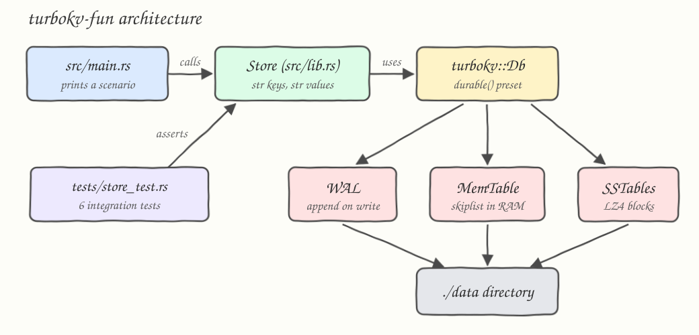

# turbokv-fun

A small Rust project that drives [TurboKV](https://github.com/kingroryg/turbokv), an embedded
key-value store, through a thin `Store` facade: string keys and values, atomic batches, prefix
scans, deletes, and durability across restarts.

## How it Works

`Store` (`src/lib.rs`) opens a `turbokv::Db` on a directory with the `durable()` preset and
exposes a small string-oriented API over TurboKV's byte-oriented one. Every write goes to the
write-ahead log and an in-memory skiplist memtable; the memtable is flushed into LZ4-compressed
SSTables in the background or on `flush()`. Reads merge the memtable and the SSTables, so a
deleted key is invisible even while its tombstone is still on disk. `src/main.rs` runs a scenario
against `./data`, and `tests/store_test.rs` asserts the semantics that matter: last write wins,
batches publish every entry, scans stay inside their prefix, and data survives close and reopen.

## Architecture



## Features

- **String facade over bytes** — TurboKV takes `AsRef<[u8]>`; `Store` encodes and decodes so the
  calling code never handles byte slices.
- **Atomic batches** — `put_all` builds one `WriteBatch`, so readers see either none or all of it.
- **Ordered prefix scans** — keys sort lexicographically, which makes `user:` a usable namespace.
- **Durable by default** — the `durable()` preset appends to the WAL before acknowledging, so a
  process crash does not lose acknowledged writes.
- **Portable AES flags** — `.cargo/config.toml` sets the `+aes` target features TurboKV's Bloom
  filter format requires, so plain `cargo build` works on ARM and x86 without exported `RUSTFLAGS`.

## Stack

- **Rust 1.98, edition 2024** — the toolchain this project is pinned to.
- **turbokv 0.6** — the embedded LSM key-value store under test.
- **tokio 1** — TurboKV's API is async, so a runtime is required; only `macros` and
  `rt-multi-thread` are enabled.

No other dependencies: the tests create and remove their own temp directories with `std::fs`.

## API

`Store` is the only public type. Every method is async and returns `Result<T, turbokv::DbError>`.

| Method | Parameters | Returns |
|---|---|---|
| `Store::open(path)` | `impl AsRef<Path>` | `Store` owning the directory exclusively |
| `put(key, value)` | `&str`, `&str` | `()`; replaces an existing key |
| `put_all(entries)` | `&[(&str, &str)]` | `()`; one atomic batch, last duplicate key wins |
| `get(key)` | `&str` | `Option<String>`; `None` when missing or deleted |
| `remove(key)` | `&str` | `()`; removing a missing key is allowed |
| `contains(key)` | `&str` | `bool` |
| `list(prefix)` | `&str` | `Vec<(String, String)>` ordered by key |
| `count(prefix)` | `&str` | `usize` matching entries |
| `flush()` | none | `()`; installs SSTables and syncs the WAL |
| `close()` | consumes `Store` | `()`; the only clean shutdown, dropping is not |

## Key Design Decisions

- **`Db` is wrapped, not re-exported.** The store's surface is the handful of operations this
  project needs, which keeps `main.rs` and the tests free of byte-slice plumbing.
- **Values decode with `from_utf8_lossy`.** Values here are always UTF-8, so decoding never fails
  and the API avoids a second error type.
- **`remove` returns `()` instead of the old value.** TurboKV 0.6.0 has no atomic `take`; a
  get-then-remove pair would report a value that another writer may already have replaced.
- **`close()` is explicit everywhere.** A dropped handle is not a clean shutdown, and the directory
  stays owned until close returns.
- **Tests own their directories.** Each test uses a uniquely named directory under the system temp
  directory and removes it on drop, so tests run in parallel without fighting over ownership.

## How to run

```bash
./build.sh
./test.sh
./run.sh
```

`build.sh` compiles in release mode, `test.sh` runs the integration tests, and `run.sh` writes to
`./data` and prints:

```
get user:1        -> Some("Ada Lovelace")
get user:404      -> None
count user:       -> 3
scan user:        -> user:1 = Ada Lovelace
scan user:        -> user:2 = Grace Hopper
scan user:        -> user:3 = Alan Turing
remove user:3     -> ok
contains user:3   -> false
count user:       -> 2
database at data
```

Re-running keeps the previous state: `./data` is a real database, delete it for a clean start.
